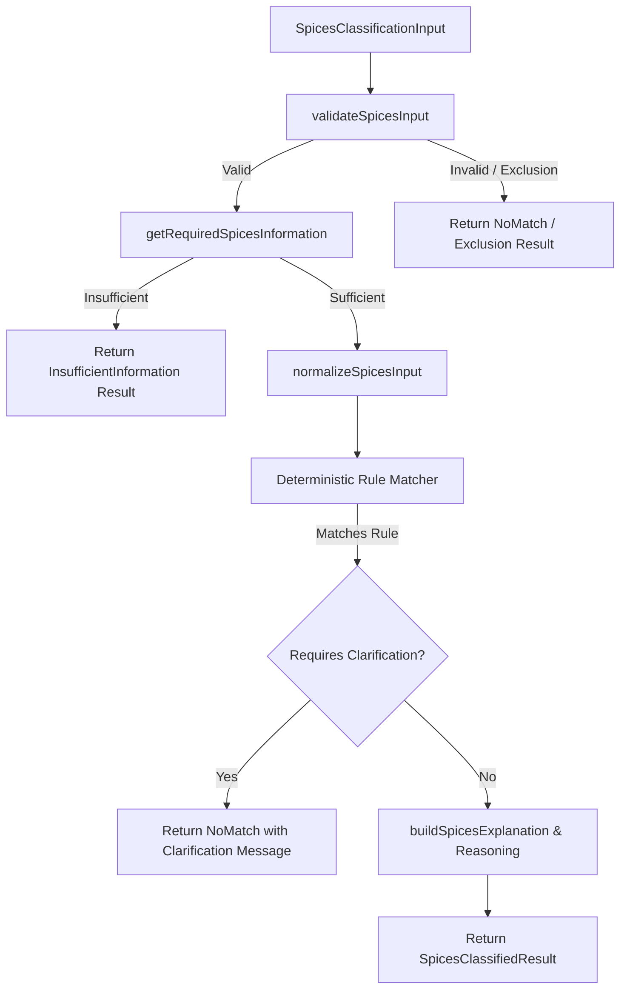

# Spices Deterministic Classification Engine Documentation — Phase 6.2

## Overview

The Spices Classification Engine provides a **100% deterministic, rules-based customs classifier** for Chapter 09 Spices (Headings **0904 through 0910**). It operates strictly on structured facts without using Large Language Models, machine learning, semantic embeddings, or external network requests.

---

## 1. Architectural Design

### Module Structure (`src/products/spices/`)
- [`types.ts`](file:///c:/Users/HP/Downloads/tariffiq-phase3/tariffiq/src/products/spices/types.ts): Concrete TypeScript definitions and discriminated union results for Spices.
- [`validateSpicesInput.ts`](file:///c:/Users/HP/Downloads/tariffiq-phase3/tariffiq/src/products/spices/validateSpicesInput.ts): Validates enum values, types, and statutory exclusions (Cubeb pepper Note 4, essential character Note 3).
- [`normalizeSpicesInput.ts`](file:///c:/Users/HP/Downloads/tariffiq-phase3/tariffiq/src/products/spices/normalizeSpicesInput.ts): Normalizes input attributes into clean internal state.
- [`requirements.ts`](file:///c:/Users/HP/Downloads/tariffiq-phase3/tariffiq/src/products/spices/requirements.ts): Dynamically computes required vs optional fields per tariff branch.
- [`explainSpicesClassification.ts`](file:///c:/Users/HP/Downloads/tariffiq-phase3/tariffiq/src/products/spices/explainSpicesClassification.ts): Builds deterministic structured explanations and step-by-step reasoning traces.
- [`classifier.ts`](file:///c:/Users/HP/Downloads/tariffiq-phase3/tariffiq/src/products/spices/classifier.ts): Evaluates rules from `spices_rules.json` against normalized facts.
- [`definition.ts`](file:///c:/Users/HP/Downloads/tariffiq-phase3/tariffiq/src/products/spices/definition.ts): ProductDefinition metadata for registry integration.
- [`index.ts`](file:///c:/Users/HP/Downloads/tariffiq-phase3/tariffiq/src/products/spices/index.ts): Product registration bundle and barrel export.

---

## 2. Input Schema & Supported Attributes

| Attribute | Type | Description |
|-----------|------|-------------|
| `productCategory` | `"spices"` | Must be `"spices"`. |
| `spiceType` | `SpiceType` | Primary commodity: `pepper`, `capsicum_pimenta`, `vanilla`, `cinnamon`, `cloves`, `nutmeg`, `mace`, `cardamom`, `coriander`, `cumin`, `anise`, `badian`, `caraway_or_fennel`, `juniper_berries`, `ginger`, `saffron`, `turmeric`, `mixture`, `other_spice`. |
| `botanicalType` | `BotanicalType` | Genus/species: `piper`, `capsicum`, `pimenta`, `cinnamomum_zeylanicum`, `cassia`. |
| `crushedOrGround` | `boolean` | `true` for crushed/ground/powdered; `false` for whole/neither crushed nor ground. |
| `subType` | `SpiceSubType` | Variety: `long_pepper`, `light_black_pepper`, `black_pepper_garbled`, `black_pepper_ungarbled`, `green_pepper_dehydrated`, `pinheads`, `green_pepper_frozen_or_dried`, `non_green_frozen`, `alleppey_green`, `coorg_green`, `bleached_half_bleached_bleachable`, `mixed`, `black`, `other_than_black`, `unbleached`, `bleached`, `cross_heading_mixture`, `celery`, `fenugreek`, `dill`, `ajwain`, `cassia_torea`, `cassia`, `poppy`, `mustard`. |
| `form` | `SpiceForm` | Physical presentation: `bark`, `tree_flowers`, `stem`, `not_stem`, `in_shell`, `shelled`, `chilly_powder`, `chilly_seeds`, `powder`, `small_cardamom_seeds`, `husk`, `stigma`, `stamen`, `seed`. |
| `processingState` | `SpiceProcessingState` | `fresh`, `dried`, `extracted`, `not_extracted`. |
| `quality` | `SpiceQuality` | `seed_quality` (for Heading 0909 seeds). |
| `sizeCategory` | `SpiceSizeCategory` | `large` (Amomum) or `small` (Elettaria) for Cardamom. |
| `isCubeb` | `boolean` | Statutory flag for Cubeb pepper (Piper cubeba) exclusion. |
| `essentialCharacter`| `boolean` | Statutory flag for Chapter 09 essential character retention. |

---

## 3. Deterministic Rule Matching & Scoped "Other" Handling

- Rules are sorted by `priority` descending (`200` down to `50`).
- More specific rules (checking botanical type, variety, form, processing state) always take precedence over generic rules.
- **Strict Invariant on "Other" Lines**:
  - The 23 "Other" lines across headings 0904–0910 are **not universal catch-alls**.
  - Each fallback rule is annotated in `spices_rules.json` with `REQUIRES SOURCE CLARIFICATION`.
  - When matched, the engine returns `status: "no_match"` explaining that the exact scope boundary requires statutory or trade clarification.
  - The classifier **never guesses**.

---

## 4. Statutory Legal Notes & Exclusions

1. **Chapter Note 1(a)**: Mixtures of products of the same heading stay within that heading.
2. **Chapter Note 1(b)**: Mixtures of products from different headings (0904–0910) classify under heading `0910` (`09109100`).
3. **Chapter Note 2 & 3 (Essential Character & Condiment Exclusion)**: If `essentialCharacter === false`, the goods are excluded from Chapter 09 and directed to heading **2103**.
4. **Chapter Note 4 (Cubeb Pepper Exclusion)**: If `isCubeb === true`, the goods (*Piper cubeba*) are excluded from Chapter 09 and directed to heading **1211**.
5. **Supplementary Notes**: Spices include whole, crushed, or powdered vegetable products rich in essential oils.

---

## 5. Product Registry & Server Authority

- **Registry**: Registered under category identifier `"spices"` in `productRegistry`. Calling `classifyProduct("spices", input)` dispatches directly to `classifySpices(input)`.
- **Server Authority**: The backend (`server/services/classificationService.ts`) independently validates confirmed product attributes and re-runs the deterministic classification engine.
- **Client Boundary Protection**: Client-supplied `hsCode`, `matchedRuleId`, `classificationPath`, and `reasoning` are completely stripped and recalculated on the server.
